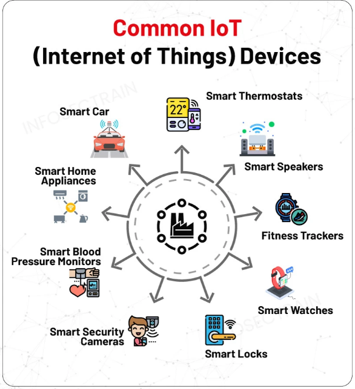

# 🎮 IoT Project Assignment – AIML. 4th Semester

 
 

## Objective:

Design and develop a working IoT-based smart system using sensors, micro-controllers, and cloud or mobile interfaces.

This project provides practical experience in:

- Embedded systems
- Sensor integration
- Wire/Wireless communication
- Real-time monitoring
- Dashboard/app development
- Documentation & presentation

Students must build a functional prototype, not just simulation.

 
 

## Team Guidelines:

- Minimum Members: 1
- Maximum Members: 4
- Each team must choose a team leader responsible for coordination and submission.

 
 

## Allowed Tools & micro-controller:

You are free to use any micro-controller such as:

- Arduino (Uno/Nano)
- Raspberry Pi/pico/zero
- NodeMCU(ESP8266/ESP32)
- Any IoT development board

 
 

## Project Deliverables (Mandatory):

#### Each team must submit the following:

### 1. Presentation (Minimum 7 Slides – PowerPoint)

Should include:

1. Title & Team Introduction
1. Problem Statement
1. Proposed IoT Solution
1. System Architecture & Components
1. Development Process
1. Demo Screenshots/Video
1. Challenges & Future Scope

 
 

### 2. Assignment File (Minimum 10 Pages excluding Index, cover)

**You must submit a Docx-->pdf file in the following format (structure below).**

- Project Title:
- Course: AIML- Section
- Semester: 4th
- Student Names & Roll Numbers
- Team Leader
- Instructor Name
- Submission Date

 

1. Introduction

- Brief about the problem
- Need for IoT solution
- Objectives

 

2. System Design Document Summary

- Architecture
- Block diagram
- Sensors/actuators
- Communication protocol

 

3. Technology Stack

- Board used
- Programming language
- Tools

 

4. Development Process

- Planning
- Roles
- Implementation stages
- Circuit building
- Screenshots

 

5. Challenges Faced

- Hardware issues
- Debugging
- Connectivity problems
- Team coordination

 

6. Final System Screenshots

Include:

- Hardware setup
- Circuit
- Dashboard/app
- Live readings
- Control action

 

7. Testing & Feedback

- Who tested?
- Observations
- Improvements made

 

8. Conclusion

- What was learned
- Skills gained
- Future enhancements

 
 

## Important Dates:

- Final Submission & Presentation:
- 16 March 2026

 
 

## How to Submit:

- Presentation: PowerPoint (.pptx)
- Assignment file: Scanned PDF of individual written record

 
 
