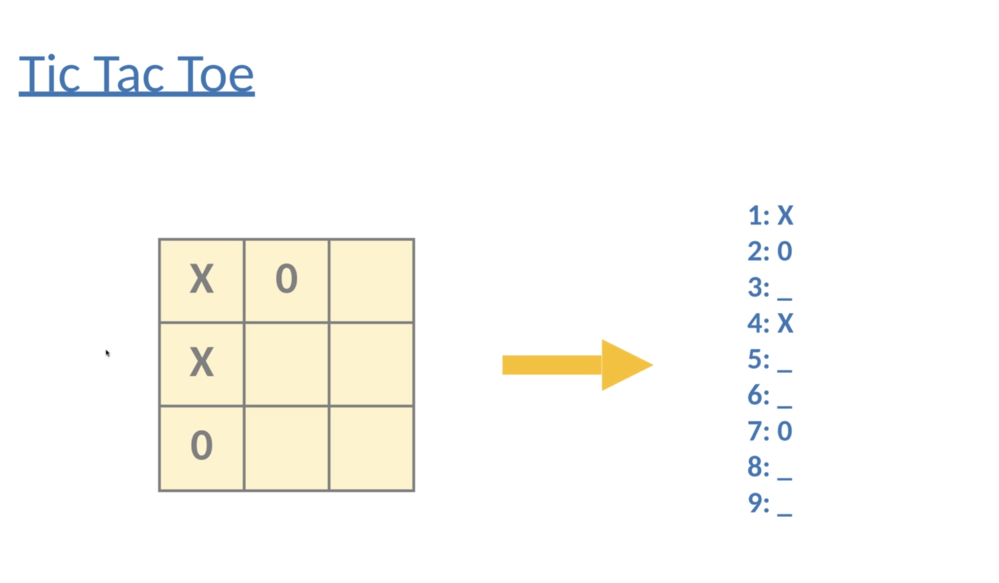

# 6.  Implement minimax and alpha-beta pruning for Tic-Tac-Toe 



```py
# number of rows and number of columns (tic-tac-toe board is 3×3)
BOARD_SIZE = 3

# this is the score given when someone wins
REWARD = 10


# This class makes the Tic Tac Toe game
class TicTacToe:

    # this runs when the game starts
    def __init__(self, board):
        self.board = board          # saves the board (9 boxes)
        self.player = 'O'           # human plays with O
        self.computer = 'X'         # computer plays with X

    # this function starts the game
    def run(self):
        print("Computer starts...")

        while True:                 # game keeps running again and again
            self.move_computer()    # computer makes a move first
            self.move_player()      # then player makes a move

    # this shows the board on screen
    def print_board(self):
        # print first row
        print(self.board[1] + '|' + self.board[2] + '|' + self.board[3])
        print('-+-+-')
        # print second row
        print(self.board[4] + '|' + self.board[5] + '|' + self.board[6])
        print('-+-+-')
        # print third row
        print(self.board[7] + '|' + self.board[8] + '|' + self.board[9])
        print('\n')

    # this puts player or computer mark on board
    def update_player_position(self, player, position):
        if self.is_cell_free(position):   # check if box is empty
            self.board[position] = player # put X or O in box
            self.check_game_state()       # check win/draw
        else:
            print("Can't insert there!")  # if box is full
            self.move_player()            # ask again

    # check if box is empty
    def is_cell_free(self, position):
        if self.board[position] == ' ':
            return True
        return False

    # check if game is over
    def check_game_state(self):
        self.print_board()                # show board

        if self.is_draw():                # check draw
            print("Draw!")
            exit()

        if self.is_winning(self.player):  # check if player wins
            print("Player wins!")
            exit()

        if self.is_winning(self.computer):# check if computer wins
            print("Computer wins!")
            exit()

    # check if someone wins
    def is_winning(self, player):

        # check diagonal (left top to right bottom)
        if self.board[1] == player and self.board[5] == player and self.board[9] == player:
            return True

        # check diagonal (right top to left bottom)
        if self.board[3] == player and self.board[5] == player and self.board[7] == player:
            return True

        # check rows and columns
        for i in range(BOARD_SIZE):

            # check rows (3 in same row)
            if self.board[3 * i + 1] == player and self.board[3 * i + 2] == player \
                    and self.board[3 * i + 3] == player:
                return True

            # check columns (3 in same column)
            if self.board[i + 1] == player and self.board[i + 4] == player \
                    and self.board[i + 7] == player:
                return True

    # check if game is draw (no empty box)
    def is_draw(self):
        for position in self.board.keys():
            if self.board[position] == ' ':
                return False
        return True

    # player turn
    def move_player(self):
        position = int(input("Enter the position for 'O':  "))  # ask player
        self.update_player_position(self.player, position)

    # computer turn
    def move_computer(self):
        best_score = -float('inf')   # start with very small score
        best_move = 0                # store best move

        # check all empty boxes
        for position in self.board.keys():
            if self.board[position] == ' ':
                self.board[position] = self.computer   # try move
                score = self.minimax(0, False)         # check score
                self.board[position] = ' '             # undo move

                if score > best_score:                 # choose best
                    best_score = score
                    best_move = position

        self.board[best_move] = self.computer           # make move
        self.check_game_state()

    # this is smart thinking part (minimax algorithm)
    def minimax(self, depth, is_maximizer):

        # if computer wins
        if self.is_winning(self.computer):
            return REWARD - depth

        # if player wins
        if self.is_winning(self.player):
            return -REWARD + depth

        # if draw
        if self.is_draw():
            return 0

        # computer turn (tries best score)
        if is_maximizer:
            best_score = -float('inf')

            for position in self.board.keys():
                if self.board[position] == ' ':
                    self.board[position] = self.computer
                    score = self.minimax(depth + 1, False)
                    self.board[position] = ' '

                    if score > best_score:
                        best_score = score

            return best_score

        # player turn (tries lowest score)
        else:
            best_score = float('inf')

            for position in self.board.keys():
                if self.board[position] == ' ':
                    self.board[position] = self.player
                    score = self.minimax(depth + 1, True)
                    self.board[position] = ' '

                    if score < best_score:
                        best_score = score

            return best_score


# this part starts the game
if __name__ == '__main__':
    # make empty board (9 boxes)
    board = {1: ' ', 2: ' ', 3: ' ',
             4: ' ', 5: ' ', 6: ' ',
             7: ' ', 8: ' ', 9: ' '}

    game = TicTacToe(board)   # create game
    game.run()                # start game
```