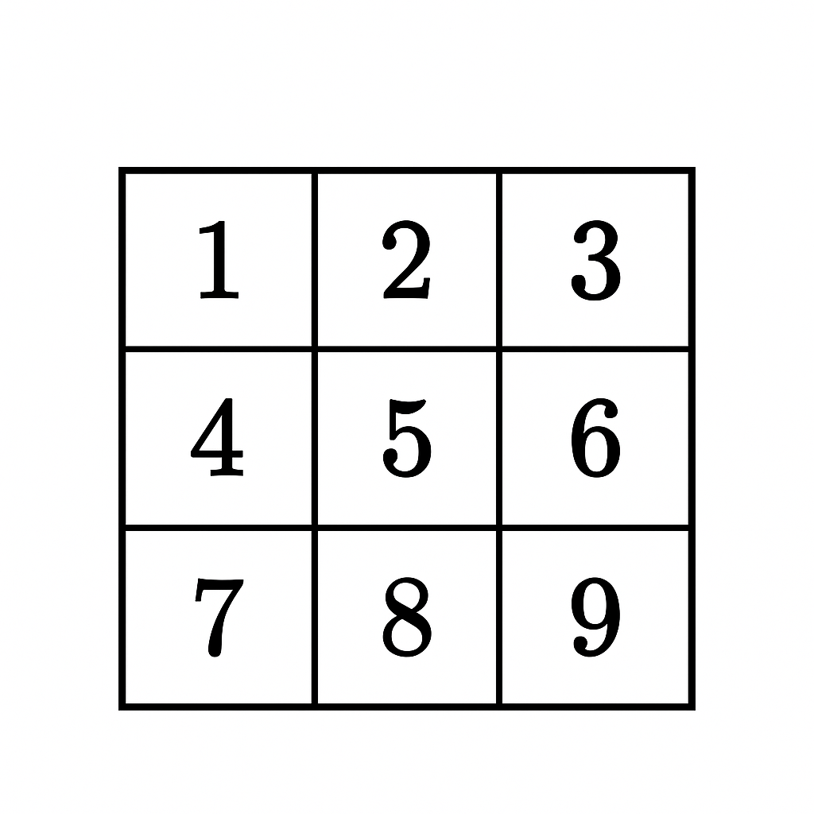

### Write a C++ program to show the

#### Matrix concept



```cpp
#include <iostream>
using namespace std;

int main()
{
    // Creating a 3x3 integer matrix
    int a[3][3];

    // Asking the user to enter 9 elements
    cout << "Enter 9 elements for the 3x3 Matrix: ";

    // Taking input from the user (row-wise)
    for (int i = 0; i < 3; i++)
    {
        for (int j = 0; j < 3; j++)
        {
            cin >> a[i][j];   // Storing element at row i and column j
        }
    }

    // Printing the matrix in proper 3x3 format
    cout << "\nThe 3x3 Matrix is:\n";
    for (int i = 0; i < 3; i++)
    {
        // Printing one row at a time
        for (int j = 0; j < 3; j++)
        {
            cout << a[i][j] << " ";   // Printing element with space
        }
        cout << endl; // Move to next line after printing each row
    }

    return 0; // Program ends
}
```

<br>
<br>

#### a. Matrix addition of 3x3 matrix
